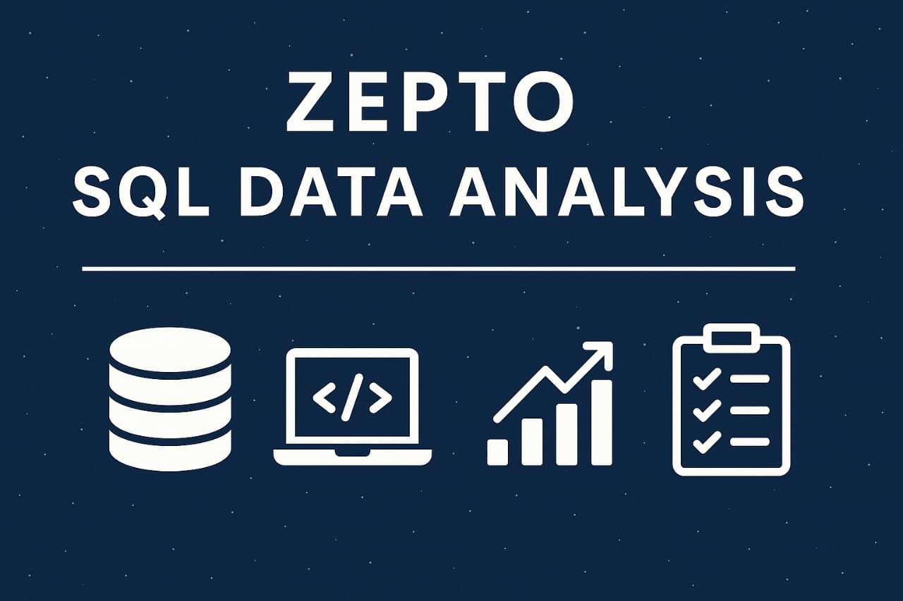

# 🛒 Zepto E-commerce SQL Data Analyst Project



Welcome to a hands-on data analyst project built using real-world inventory data from Zepto, one of India’s fastest-growing quick-commerce startups. This project simulates an analyst's journey from raw data ingestion to business-driven SQL analysis, using over 3,700 product listings from Zepto's catalog.

---

## 🎯 Project Goal

To simulate an end-to-end SQL data analyst workflow for a fast-paced e-commerce business. The objective is to
- Build and clean an inventory dataset in SQL
- Perform exploratory and business-driven analysis
- Extract actionable insights on pricing, inventory, discounts, and stock behavior
- Mimic how data analysts contribute to product and operations teams with data-backed decision-making

---

## 📦 Dataset Overview

This dataset captures product-level data scraped from Zepto’s online grocery catalog. It reflects how products are managed, priced, and stocked in a real commercial setting.

- File Name `zepto_inventory_data.xlsx` or `zepto_ds.csv`
- Dataset Source [Kaggle – Zepto Inventory Dataset](httpswww.kaggle.comdatasetspalvinder2006zepto-inventory-datasetdataselect=zepto_v2.csv)
- Total Records 3,732 rows
- Columns 9
- Format Excel or CSV – easily importable into PostgreSQL, Python, or Excel

### 🧾 Schema

 Column                    Description                                              
------------------------------------------------------------------------------------
 `sku_id`                  Unique identifier for each SKU                          
 `name`                    Product name                                             
 `category`                Product category (e.g., Dairy, Snacks, Fruits)          
 `mrp`                     Maximum Retail Price (₹, converted from paise)          
 `discountPercent`         Discount applied to MRP (%)                             
 `discountedSellingPrice` Final price after discount (₹)                          
 `availableQuantity`       Inventory count                                          
 `weightInGms`             Product weight in grams                                  
 `outOfStock`              Boolean flag for stock status                            
 `quantity`                Units per package or pack count                         

---


## 🧰 Project Setup

### Database Table Creation

```sql
CREATE TABLE zepto (
  sku_id SERIAL PRIMARY KEY,
  category VARCHAR(120),
  name VARCHAR(150) NOT NULL,
  mrp NUMERIC(8,2),
  discountPercent NUMERIC(5,2),
  availableQuantity INTEGER,
  discountedSellingPrice NUMERIC(8,2),
  weightInGms INTEGER,
  outOfStock BOOLEAN,
  quantity INTEGER
);
```
## Data Import

copy zepto(category, name, mrp, discountPercent, availableQuantity,
            discountedSellingPrice, weightInGms, outOfStock, quantity)
FROM 'datazepto_ds.csv' WITH (FORMAT csv, HEADER true, DELIMITER ',', QUOTE '', ENCODING 'UTF8');

## 🔍 Data Exploration

-- Total number of records
```
SELECT COUNT() FROM zepto;
```
📌 Insight Confirms total SKU entries 3,732

-- Sample 10 rows
```
SELECT  FROM zepto LIMIT 10;
```
📌 Insight Understand column values, patterns, and anomalies

-- Check for NULL values
```
SELECT  FROM zepto
WHERE name IS NULL OR category IS NULL OR mrp IS NULL
  OR discountPercent IS NULL OR availableQuantity IS NULL
  OR discountedSellingPrice IS NULL OR weightInGms IS NULL
  OR outOfStock IS NULL OR quantity IS NULL;
 ``` 
📌 Insight Identify incomplete or corrupt records

-- Distinct product categories
```
SELECT DISTINCT category FROM zepto ORDER BY category;
```
📌 Insight Count of categories can help in segmentation and filter analysis

-- In-stock vs Out-of-stock
```
SELECT outOfStock, COUNT() FROM zepto GROUP BY outOfStock;
```
📌 Insight Helps assess inventory health and replenishment needs

-- Duplicate product names (multiple SKUs for same product)
```
SELECT name, COUNT() AS sku_count
FROM zepto
GROUP BY name
HAVING COUNT()  1
ORDER BY sku_count DESC;
```
📌 Insight Products appear in multiple variants (e.g., sizes, packs) — normal in retail

## 🧹 Data Cleaning
```
-- Identify entries with price = 0
SELECT  FROM zepto WHERE mrp = 0 OR discountedSellingPrice = 0;
```
-- Delete invalid records
```
DELETE FROM zepto WHERE mrp = 0;
```
-- Convert paise to rupees
```
UPDATE zepto
SET mrp = mrp  100.0,
    discountedSellingPrice = discountedSellingPrice  100.0;
```

## 📊 Business Insights via SQL

1. 🔟 Top 10 Best-Value Products
```
SELECT DISTINCT name, mrp, discountPercent
FROM zepto
ORDER BY discountPercent DESC
LIMIT 10;
```
💡 Insight These products offer the highest discounts, great for promotions and banners.

2. 🛑 High-MRP Products Out of Stock
```
SELECT DISTINCT name, mrp
FROM zepto
WHERE outOfStock = TRUE AND mrp  300
ORDER BY mrp DESC;
```
💡 Insight These are high-ticket items currently unavailable — may result in lost revenue if not restocked.

3. 💰 Revenue by Category
```
SELECT category,
SUM(discountedSellingPrice  availableQuantity) AS total_revenue
FROM zepto
GROUP BY category
ORDER BY total_revenue DESC;
```
💡 Insight Reveals top revenue-generating categories — useful for product prioritization.

4. 💸 Expensive Products with Low Discount
```
SELECT DISTINCT name, mrp, discountPercent
FROM zepto
WHERE mrp  500 AND discountPercent  10
ORDER BY mrp DESC, discountPercent DESC;
```
💡 Insight These are premium-priced items that could benefit from promotional pricing.

5. ⭐ Categories with Highest Average Discounts
```
SELECT category,
ROUND(AVG(discountPercent), 2) AS avg_discount
FROM zepto
GROUP BY category
ORDER BY avg_discount DESC
LIMIT 5;
```
💡 Insight Identifies high-discount categories — ideal for discount marketing or sales strategy.

6. ⚖️ Price Per Gram
```
SELECT DISTINCT name, weightInGms, discountedSellingPrice,
ROUND(discountedSellingPrice  weightInGms, 2) AS price_per_gram
FROM zepto
WHERE weightInGms = 100
ORDER BY price_per_gram;
```
💡 Insight Helps surface best value-for-money items in terms of quantity per ₹.

7. 📦 Weight-Based Product Segmentation
```
SELECT DISTINCT name, weightInGms,
CASE
  WHEN weightInGms  1000 THEN 'Low'
  WHEN weightInGms  5000 THEN 'Medium'
  ELSE 'Bulk'
END AS weight_category
FROM zepto;
```
💡 Insight Enables packaging strategy and inventory planning based on product size.

8. 🧮 Total Inventory Weight by Category
```
SELECT category,
SUM(weightInGms  availableQuantity) AS total_weight
FROM zepto
GROUP BY category
ORDER BY total_weight DESC;
```
💡 Insight Understand physical storage demands by category — relevant for logistics and warehouse teams.

## 📜 License
MIT License – use freely, fork it, and build on it.

## 👨‍💻 About the Author
Charka Mahesh — Aspiring Data Analyst

📬 Email charkamaheshmahi@gmail.com
